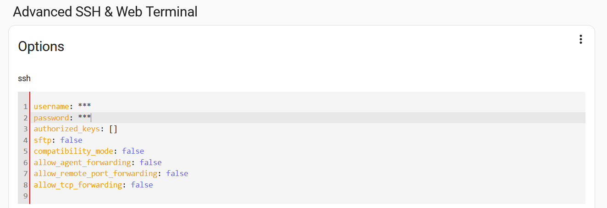
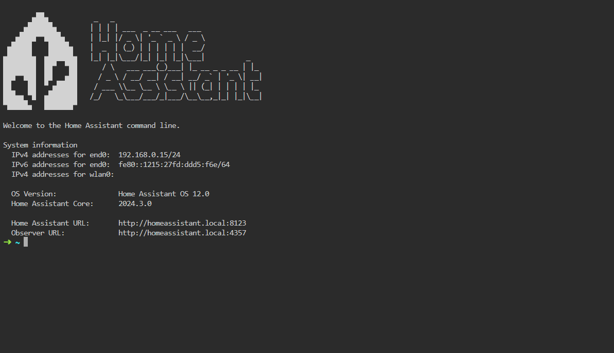

# Setup


## Matériel

Pour cette partie du projet, vous aurez besoin des éléments suivants:
- Un Raspberry Pi (de préférence un modèle 3B ou plus récent)
- Une alimentation adaptée à votre Raspberry Pi
- Un boitier pour protéger votre Raspberry Pi
- Une carte microSD (32 Go minimum ; de préférence une carte de catégorie "Application Class 2" ou plus)
- Un lecteur de carte microSD
- Un cable Ethernet et une connexion internet (au moins pour l'installation des dépendances)

* Source: [Home Assistant - Installation - Raspberry Pi](https://www.home-assistant.io/installation/raspberrypi/)

## Home Assistant

Pour installer Home Assistant sur votre Raspberry Pi, veuillez suivre les instructions suivantes:
1. Télécharger Raspberry Pi Imager sur votre ordinateur: [Raspberry Pi Imager](https://www.raspberrypi.com/software/)
2. Ouvrir Raspberry Pi Imager et suivre les instructions suivantes:
   1. Renseigner le modèle de votre Raspberry Pi
   2. Choisir le système d'exploitation "Système d'exploitation > Other specific-purpose OS > Home assistants and home automation > Home Assistant"
   3. Sélectionner la carte microSD sur laquelle vous souhaitez installer Home Assistant
   4. Cliquer sur "Suivant" et attendre la fin de l'installation
3. Insérer la carte microSD dans votre Raspberry Pi et attendez environ 5 - 10 minutes pour que Home Assistant démarre
4. Ouvrir un navigateur web et accéder à l'adresse suivante: [`http://homeassistant.local:8123`](http://homeassistant.local:8123)
5. Suivez les instructions de configuration pour terminer l'installation

Normalement, vous devriez voir l'interface de Home Assistant et vous pourrez commencer à configurer votre système.

Pour ce projet, nous allons utiliser certains modules complémentaires disponibles sur Home Assistant. Pour les installer, veuillez suivre les instructions suivantes:
1. Ouvrir Home Assistant (avec le compte administrateur)
2. Cliquer sur "Paramètres (en bas à gauche) > Modules complémentaires"
3. Cliquer sur "Boutique de modules complémentaires (en bas à droite)"
4. Rechercher les modules complémentaires suivants et les installer:
   - File editor
   - Mosquitto broker
   - Et un module complémentaire pour accéder au terminal de votre Raspberry Pi. Ce module contient les lettres "SSH" dans son nom. (Nous utilisons le module "Advanced SSH & Web Terminal")
5. Une fois les modules complémentaires installés, vous pouvez les configurer en cliquant sur les modules complémentaires dans la liste des modules complémentaires installés puis "Configuration". **Attention: cette action est particulièrement importante pour le module SSH, car il vous permettra d'accéder au terminal de votre Raspberry Pi. Vous devez donc renseigner les informations de connexion à votre Raspberry Pi.**


*Dans notre cas, nous remplaçons `***` pour les `username` et `password` par les informations de connexion à Home Assistant.*

**Pour permettre à Home Assistant de charger les modules complémentaires, il est recommandé de redémarrer le système hôte. Aller dans "Paramètres (en bas à gauche) > cliquer sur les trois points en haut à droite > Redémarrer Home Assistant > Options avancées > Redémarrer le système".**

## Home Assistant Community Store (HACS)

Pour ce projet, nous utiliserons également certains modules complémentaires développés par la communauté. Ces modules ne sont malheureusement pas disponibles dans la boutique de modules complémentaires de Home Assistant, mais sur une boutique de modules complémentaires tierce appelée "Home Assistant Community Store" ([HACS](https://hacs.xyz/)).

Pour installer HACS, veuillez suivre les instructions suivantes:
1. Ouvrir Home Assistant (avec le compte administrateur)
2. Cliquer dans votre barre latérale sur le module SSH
3. Un terminal s'ouvrira dans votre navigateur web. Cela devrait ressembler à ceci:

4. Dans le terminal, veuillez exécuter la commande suivante:
```bash
wget -O - https://get.hacs.xyz | bash -
```
5. A cette étape, HACS recommande de vider le cache de votre navigateur web. (Cela devrait ce trouver dans les paramètres de votre navigateur web. En cas de doute, vous pouvez également redémarrer votre navigateur web)
6. Une fois l'installation terminée allez dans "Paramètres > Appareils et services > Intégrations" et recherchez "HACS" dans "+ Ajouter une intégration" (Si vous ne trouvez pas HACS, redémarrez Home Assistant et réessayez)
7. Accepeter les conditions d'utilisation (**Sauf la dernière condition qui concerne les fonctionnalités expérimentales**)
8. A cette étape, HACS vous demandera de vous connecter avec votre compte GitHub. (Si vous n'avez pas de compte GitHub, vous pouvez en créer un gratuitement sur [GitHub](https://github.com))
9. Une fois connecté, vous devriez voir l'interface de HACS dans votre barre latérale.
10. Optionnel: Nous vous recommandons de redémarrer Home Assistant pour que les modifications soient prises en compte.

## Installation des dépendances - HACS

Pour installer les dépendances nécessaires à ce projet, veuillez suivre les instructions suivantes:
1. Ouvrir Home Assistant (avec le compte administrateur)
2. Cliquer sur "HACS" dans votre barre latérale
3. Cliquer sur "Intégrations" dans le menu en haut de la page
4. Cliquer sur "Explorer et télécharger des dépôts"
5. Rechercher les dépôts suivants et les installer:
   - [Dual Smart Thermostat](https://github.com/swingerman/ha-dual-smart-thermostat)
